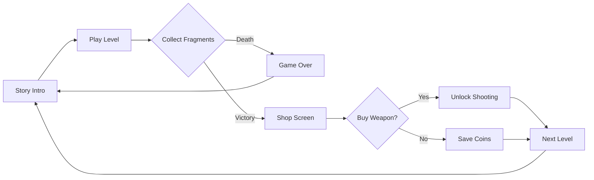

<div align="center">

# 🌀 VoidLoop: Cyber-Survival


### *A frenetic top-down shooter in an endless digital void*

**[📺 Watch Gameplay](https://youtu.be/vAMfQcXAbkE) • [🎮 Quick Start](#-quick-start) • [🕹️ Controls](#️-controls) • [📖 How to Play](#-how-to-play)**

---

### 🎬 See VoidLoop in Action

[](https://youtu.be/vAMfQcXAbkE)

*Click to watch the full gameplay demo on YouTube*

</div>

---

## 🌟 What is VoidLoop?

**VoidLoop** is an intense **top-down arcade shooter** where you're trapped in a hostile digital simulation. Your mission: collect fragments, survive endless enemy waves, and break free from the infinite loop.

### ✨ Key Highlights

- 🎯 **Progressive Difficulty**: Each level introduces new challenges - from simple chase enemies to bullet hell scenarios
- ⚡ **Advanced Movement**: Master **Dash** and **Sprint** mechanics to survive impossible situations
- 🛡️ **Strategic Obstacles**: Use walls as cover against enemy projectiles (Level 3+)
- 🔫 **Arsenal System**: Earn coins to unlock powerful weapons in the inter-level shop
- 💾 **Smart Save System**: Your progress is automatically saved - continue anytime
- 🌍 **4 Languages**: Full localization in Italian, English, Spanish, and French
- 👥 **Local Co-op**: Team up with a friend in 2-player mode
- 💀 **4 Difficulty Modes**: From Easy to Nightmare - each with unique enemy behavior

---

## 🎮 Core Features

### 🎯 Gameplay Mechanics

| Feature | Description |
|---------|-------------|
| **🏃 Movement System** | Smooth 8-directional movement with physics-based collision |
| **⚡ Dash** | Rapid 60-pixel teleport on 45-frame cooldown (Shift) |
| **🔥 Sprint** | 1.8x speed boost while holding Ctrl |
| **🎯 Mouse Aiming** | Pixel-perfect targeting after weapon unlock |
| **🧱 Solid Walls** | Dynamic obstacles that block movement and projectiles |
| **⏱️ Level Timer** | Track your speedrun times for each level |

### 🎲 Progression System

```
Level 1-2  → Basic Chase Enemies (no shooting)
   ↓
Level 3-4  → Enemies start shooting (slow projectiles)
             First walls appear
   ↓
Level 5+   → INTENSE: Fast enemies, rapid-fire bullets
             20+ walls, bullet hell scenarios
             ⚠️ Weapon required to survive!
```

### 💰 Economy & Shop

- **Earn coins** by collecting golden data fragments (1 coin per fragment)
- **Weapon costs** scale with difficulty:
  - 🟢 Easy: 5 coins
  - 🟡 Normal: 10 coins
  - 🔴 Hard: 20 coins
  - 💀 Nightmare: 30 coins

---

## 🕹️ Controls

### 👤 Player 1 (Primary Controls)

<table>
<tr>
<td width="50%">

**🏃 Movement**
- <kbd>W</kbd> Move Up
- <kbd>A</kbd> Move Left  
- <kbd>S</kbd> Move Down
- <kbd>D</kbd> Move Right

</td>
<td width="50%">

**⚡ Advanced Movement**
- <kbd>Left Ctrl</kbd> Sprint (1.8x speed)
- <kbd>Left Shift</kbd> Dash (quick teleport)
  - *Cooldown: 45 frames (~0.75s)*
  - *Distance: 60 pixels*

</td>
</tr>
<tr>
<td colspan="2">

**🔫 Combat** *(After weapon purchase)*
- <kbd>Mouse</kbd> Aim cursor
- <kbd>Left Click</kbd> Fire (12-frame cooldown)

**🎮 System**
- <kbd>Space</kbd> Skip dialogues / Continue
- <kbd>ESC</kbd> Quit to desktop

</td>
</tr>
</table>

### 👥 Player 2 (Co-op Mode)

| Action | Keys |
|--------|------|
| Movement | <kbd>↑</kbd> <kbd>↓</kbd> <kbd>←</kbd> <kbd>→</kbd> |
| Sprint | <kbd>Right Ctrl</kbd> |
| Dash | <kbd>Right Shift</kbd> |
| Combat | *Shares P1's mouse controls* |

### 💡 Pro Tips

```diff
+ Dash through walls of bullets in emergencies
+ Use Sprint + Dash combo for maximum mobility
+ Hide behind walls to block enemy fire (Level 3+)
+ Diagonal movement (W+D, etc.) is faster
+ Save your Dash cooldown for critical moments
```

---

## 🚀 Quick Start

### 📋 Requirements

- **Python 3.8+** (Download from [python.org](https://www.python.org/downloads/))
- **Pygame 2.5+** (Auto-installed via requirements.txt)
- **~50 MB** disk space
- **512 MB RAM** minimum

---

### 🐧 Linux / macOS

```bash
# Clone the repository
git clone https://github.com/BitJacker/VoidLoop.git
cd VoidLoop

# Install dependencies
pip3 install -r requirements.txt

# Launch the game
python3 play.py
```

**Alternative: One-Line Setup**
```bash
git clone https://github.com/BitJacker/VoidLoop.git && cd VoidLoop && pip3 install -r requirements.txt && python3 play.py
```

---

### 🪟 Windows

#### Option A: Automatic Setup

1. Download the repository as [ZIP file](https://github.com/BitJacker/VoidLoop/archive/refs/heads/main.zip)
2. Extract to a folder
3. Double-click `setup.bat`
4. Run `play.py` (double-click or use `python play.py`)

#### Option B: Manual Setup

```powershell
# Install Python 3.8+ from python.org first!
# Then open PowerShell in the game folder:

pip install -r requirements.txt
python play.py
```

---

### 🍎 macOS (via Homebrew)

```bash
# Install Homebrew (if not already installed)
/bin/bash -c "$(curl -fsSL https://raw.githubusercontent.com/Homebrew/install/HEAD/install.sh)"

# Install Python
brew install python3

# Clone and run
git clone https://github.com/BitJacker/VoidLoop.git
cd VoidLoop
pip3 install -r requirements.txt
python3 play.py
```

---

## 📖 How to Play

### 🎯 Objective

**Survive and synchronize.** Collect golden **data fragments** to fill the synchronization bar. Complete the required fragments to advance to the next level. Each level increases difficulty exponentially.

### 🎮 Gameplay Loop



### 📊 Difficulty Progression

| Difficulty | Speed Mult. | Spawn Rate | Weapon Cost |
|------------|-------------|------------|-------------|
| 🟢 **Easy** | 0.7x | Low | 5 coins |
| 🟡 **Normal** | 1.0x | Medium | 10 coins |
| 🔴 **Hard** | 1.4x | High | 20 coins |
| 💀 **Nightmare** | 1.9x | Very High | 30 coins |

### 🏆 Enemy Evolution

**Levels 1-2: Tutorial**
- Enemies only chase you
- No projectiles
- No walls
- Focus on movement mechanics

**Levels 3-4: Advanced**
- ⚠️ Enemies start shooting slow projectiles
- 5-10 wall obstacles appear
- Enemy speed increases by 30%
- Shoot cooldown: 120-220 frames

**Levels 5+: Expert / Bullet Hell**
- 🔥 **Enemies shoot rapidly** (35-70 frame cooldown)
- 💨 **Fast projectiles** (speed: 11 units)
- 🧱 **20+ wall obstacles**
- 🚀 **Enemy speed: 1.8x+**
- 💀 **Survival without weapon is nearly impossible**

---

## 💾 Save System

### 📂 Save Location

```
VoidLoop/
└── saves/
    └── savegame.json
```

**Auto-saves when:**
- ✅ You complete a level
- ✅ You purchase a weapon
- ✅ You enter the shop screen

**Save Data:**
```json
{
  "level": 5,
  "coins": 37
}
```

### 🔄 Continue vs New Game

The launcher (`play.py`) automatically detects your save file:

- **CONTINUE GAME**: Resume from your saved level with all coins
- **NEW GAME**: Start fresh (asks for confirmation if save exists)

---

## 📂 Project Structure

```
VoidLoop/
├── play.py                    # 🎮 Launcher with config menu + save detection
├── voidloopgame.py           # 🎯 Main game engine (3000+ lines)
├── requirements.txt          # 📦 Python dependencies
├── setup.bat                 # 🪟 Windows auto-setup script
├── setup.sh                  # 🐧 Linux/Mac auto-setup script
│
├── VoidLoop/                 # Game directory (created after setup)
│   ├── saves/                # 💾 Save files (auto-generated)
│   │   └── savegame.json
│   │
│   └── lang/                 # 🌍 Localization files
│       ├── dialogues_it.json # Italian
│       ├── dialogues_en.json # English
│       ├── dialogues_es.json # Spanish
│       └── dialogues_fr.json # French
│
├── README.md                 # 📖 This file
├── LICENSE                   # 📜 Usage rights
├── .gitignore               # 🔒 Git ignore rules
└── venv/                    # 🐍 Virtual environment (optional)
```

---

## 🔧 Troubleshooting

### ❌ Common Issues

<details>
<summary><b>Error: "No module named 'pygame'"</b></summary>

**Solution:**
```bash
pip install pygame --upgrade --user
```

Or if using pip3:
```bash
pip3 install pygame --upgrade
```
</details>

<details>
<summary><b>Error: "Game file not found"</b></summary>

**Cause:** `voidloopgame.py` is not in the `VoidLoop/` folder.

**Solution:**
```bash
# Verify file structure
ls -la VoidLoop/voidloopgame.py

# If missing, copy it
cp voidloopgame.py VoidLoop/
```
</details>

<details>
<summary><b>Error: "Dialogue files not found"</b></summary>

**Cause:** Missing localization files in `VoidLoop/lang/`

**Solution:**
Create the required JSON files. Minimum example for `dialogues_en.json`:
```json
{
  "prologue": [
    "SYSTEM: Initialization...",
    "Welcome to VOID LOOP.",
    "Press SPACE to continue."
  ],
  "game_over": [
    "CONNECTION LOST.",
    "Rebooting...",
    "Press SPACE."
  ]
}
```
</details>

<details>
<summary><b>Game is laggy / slow framerate</b></summary>

**Solutions:**
- Close background applications (browsers, Discord, etc.)
- Use **windowed mode** instead of fullscreen
- Update your graphics drivers
- Reduce screen resolution in launcher settings
</details>

<details>
<summary><b>Save file not working</b></summary>

**Solutions:**
1. Check folder permissions:
```bash
chmod 755 VoidLoop/saves/
```

2. Verify save file exists:
```bash
cat VoidLoop/saves/savegame.json
```

3. If corrupted, delete and restart:
```bash
rm VoidLoop/saves/savegame.json
```
</details>

<details>
<summary><b>Linux: "Permission denied" when running setup.sh</b></summary>

**Solution:**
```bash
chmod +x setup.sh
./setup.sh
```
</details>

---

## 🎨 Customization

### 🖌️ Adding New Ship Colors

Edit `voidloopgame.py`:
```python
COLOR_MAP = {
    "Neon Green": (0, 255, 150),
    "Cyber Blue": (0, 150, 255),
    "Void Purple": (180, 0, 255),
    "Your Color": (R, G, B)  # Add here
}
```

Then update `play.py` launcher:
```python
("◆ SHIP COLOR", self.color_var, 
 ["Neon Green", "Cyber Blue", "Void Purple", "Your Color"], 
 "#00ffff"),
```

### ⚙️ Tweaking Difficulty

Edit `DIFF_SETTINGS` in `voidloopgame.py`:
```python
DIFF_SETTINGS = {
    "CUSTOM": {
        "speed_mult": 1.2,    # Enemy speed multiplier
        "spawn_rate": 0.012,  # Spawn chance per frame
        "cost": 15            # Weapon price in coins
    }
}
```

### 🎵 Adding Background Music (Optional)

```python
# At the top of voidloopgame.py
pygame.mixer.init()
pygame.mixer.music.load("music/soundtrack.mp3")
pygame.mixer.music.play(-1)  # Loop forever
```

---

## ❓ FAQ

<details>
<summary><b>Q: Is there an endless mode?</b></summary>

**A:** Not yet! It's planned for v1.1. Currently, the game progressively gets harder with each level.
</details>

<details>
<summary><b>Q: Can I play with a controller/gamepad?</b></summary>

**A:** Not in v2.0. Gamepad support is planned for v2.2.
</details>

<details>
<summary><b>Q: What happens when I die?</b></summary>

**A:** You respawn at the current level with the same coins and weapon status. Progress is NOT lost on death.
</details>

<details>
<summary><b>Q: How many levels are there?</b></summary>

**A:** The game is **infinite**. Levels progressively get harder with no upper limit. Current record is level 12+.
</details>

<details>
<summary><b>Q: Can I modify the source code?</b></summary>

**A:** You can study it for educational purposes, but redistribution of modified versions is prohibited. See [License](#-license).
</details>

<details>
<summary><b>Q: Where can I report bugs?</b></summary>

**A:** Create an issue on GitHub or contact the developer directly.
</details>

---

## 🗺️ Roadmap

### ✅ Version 2.0 (Current)
- [x] Dash & Sprint mechanics
- [x] Solid wall obstacles
- [x] Level timer
- [x] Enhanced shop UI
- [x] Save game detection in launcher

### 🔜 Version 2.1 (Planned)
- [ ] Endless survival mode
- [ ] Global leaderboards
- [ ] More weapon types (shotgun, laser, etc.)
- [ ] Temporary power-ups (shield, speed boost)

### 🔮 Future (Version 2.2+)
- [ ] Boss fights every 5 levels
- [ ] Online multiplayer
- [ ] Level editor
- [ ] Gamepad support
- [ ] Achievements system
- [ ] Sound effects & music
- [ ] Particle effects

---

## 📜 License

**VoidLoop** - Copyright © 2026 BitJacker  
**All Rights Reserved**

### ✅ You MAY:
- ✔️ Download and play the game for personal use
- ✔️ Study the source code for educational purposes
- ✔️ Share the game with friends (via GitHub link)

### ❌ You MAY NOT:
- ❌ Modify and redistribute the code
- ❌ Use the game or code for commercial purposes
- ❌ Sell the game or derivative works
- ❌ Use assets (code, dialogues, graphics) in other projects

For licensing inquiries, contact the author.

---

## 👤 Credits

### 🎮 Development
**Created by:** BitJacker  
**Engine:** Pygame 2.5+  
**Language:** Python 3.8+

### 🙏 Special Thanks
- **Pygame Community** for the excellent game framework
- **Python Software Foundation** for the language
- **Beta Testers** who provided valuable feedback
- **You** for playing VoidLoop!

---

## 🌐 Links

- 📺 **Gameplay Video**: [Watch on YouTube](https://youtu.be/vAMfQcXAbkE)
- 📦 **Download**: [GitHub Releases](#)
- 🐛 **Report Bugs**: [GitHub Issues](#)
- 📖 **Documentation**: [Read the Docs](#)

---

<div align="center">

## 💖 Enjoy the Game!

**If you like VoidLoop, consider:**
- ⭐ Starring this repository
- 🔄 Sharing with friends
- 💬 Leaving feedback

### Made with ❤️ and ☕ by BitJacker

[](https://www.python.org/)
[](https://www.pygame.org/)

[🔝 Back to Top](#-voidloop-cyber-survival)

---

**Version 2.0 - BitJacker Edition** | **2026**

</div>
