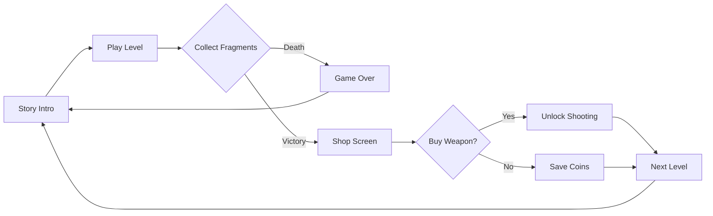

<div align="center">

# 🌀 VoidLoop: Cyber-Survival


### *A frenetic top-down shooter in an endless digital void*

**[📺 Watch Gameplay](https://youtu.be/vAMfQcXAbkE) • [🎮 Quick Start](#-quick-start) • [🕹️ Controls](#️-controls) • [📖 How to Play](#-how-to-play)**

---

### 🎬 See VoidLoop in Action

[](https://youtu.be/vAMfQcXAbkE)

*Click to watch the full gameplay demo on YouTube*

</div>

---

## 🌟 What is VoidLoop?

**VoidLoop** is an intense **top-down arcade shooter** where you're trapped in a hostile digital simulation. Your mission: collect fragments, survive endless enemy waves, and break free from the infinite loop.

### ✨ Key Highlights

- 🎯 **5 Game Modes**: Story, Endless, Time Attack, Boss Rush, Horde
- ⚡ **Advanced Movement**: Master **Dash** and **Sprint** mechanics
- 👾 **4 Enemy Types**: Normal, Tank, Sniper, Kamikaze
- 🦸 **Epic Boss Fights**: Multi-phase battles with dynamic patterns
- 💫 **Power-ups**: Shield, Speed, Double Damage, Rapid Fire
- 🎨 **Particle Effects**: Explosions, trails, and visual polish
- 🎯 **Combo System**: Chain kills for bonus rewards
- 🛡️ **Strategic Obstacles**: Use walls as cover (Level 3+)
- 🔫 **Arsenal System**: Unlock powerful weapons
- 💾 **Smart Save System**: Continue anytime
- 🌍 **4 Languages**: Italian, English, Spanish, French
- 👥 **Local Co-op**: 2-player mode

---

## 🎮 Core Features

### 🎯 Five Game Modes

| Mode | Description | Objective |
|------|-------------|-----------|
| 🎬 **STORY** | Campaign with boss fights every 5 levels | Complete sequential levels |
| ♾️ **ENDLESS** | Survive as long as possible | Beat your high score |
| ⏱️ **TIME ATTACK** | Race against the clock | Complete levels FAST |
| 🦸 **BOSS RUSH** | Face only bosses, level after level | Ultimate combat challenge |
| 🌊 **HORDE** | Survive waves of enemies | Clear 10 waves per level |

### 👾 Enemy Types

| Type | HP | Behavior | Threat Level |
|------|----|---------:|--------------|
| 🔴 **Normal** | 1 | Standard chase + shoot | ⭐⭐ |
| 🟤 **Tank** | 3+ | Slow, triple-shot spread | ⭐⭐⭐⭐ |
| 🟠 **Sniper** | 1 | Fast bullets, keeps distance | ⭐⭐⭐ |
| 🟣 **Kamikaze** | 1 | Lightning fast, suicide attack | ⭐⭐⭐⭐⭐ |

### 🦸 Boss Fights

**3-Phase Combat System:**
- **Phase 1** (100-60% HP): Circular movement, single shots
- **Phase 2** (60-30% HP): Zigzag pattern, multi-target fire
- **Phase 3** (<30% HP): Aggressive pursuit, 360° bullet spread

**Rewards:** +50 coins per boss defeated

### ⚡ Power-ups

| Power-up | Duration | Effect |
|----------|----------|--------|
| 🛡️ **SHIELD** | 5s | Immunity to all damage |
| ⚡ **SPEED** | 4s | +50% movement speed |
| 💥 **DOUBLE DAMAGE** | 3s | 2x bullet damage |
| 🔫 **RAPID FIRE** | 3.3s | Fire rate ×3 |

### 🎯 Combo System

- Chain enemy kills and fragment pickups
- **2-second window** to maintain combo
- Bonus coins every 5 combo
- Visual feedback: White → Orange → **Gold**

---

## 🕹️ Controls

### 👤 Player 1 (Primary Controls)

<table>
<tr>
<td width="50%">

**🏃 Movement**
- <kbd>W</kbd> Move Up
- <kbd>A</kbd> Move Left  
- <kbd>S</kbd> Move Down
- <kbd>D</kbd> Move Right

</td>
<td width="50%">

**⚡ Advanced Movement**
- <kbd>Left Ctrl</kbd> Sprint (1.8x speed)
- <kbd>Left Shift</kbd> Dash (quick teleport)
  - *Cooldown: 45 frames (~0.75s)*
  - *Distance: 60 pixels*

</td>
</tr>
<tr>
<td colspan="2">

**🔫 Combat** *(After weapon purchase)*
- <kbd>Mouse</kbd> Aim cursor
- <kbd>Left Click</kbd> Fire (12-frame cooldown)

**🎮 System**
- <kbd>Space</kbd> Skip dialogues / Continue
- <kbd>ESC</kbd> Quit to desktop

</td>
</tr>
</table>

### 👥 Player 2 (Co-op Mode)

| Action | Keys |
|--------|------|
| Movement | <kbd>↑</kbd> <kbd>↓</kbd> <kbd>←</kbd> <kbd>→</kbd> |
| Sprint | <kbd>Right Ctrl</kbd> |
| Dash | <kbd>Right Shift</kbd> |
| Combat | *Shares P1's mouse controls* |

### 💡 Pro Tips

```diff
+ Dash through walls of bullets in emergencies
+ Combine Sprint + Dash for maximum mobility
+ Hide behind walls to block enemy fire (Level 3+)
+ Maintain combos for extra coin income
+ Save SHIELD power-up for boss Phase 3
+ RAPID FIRE + DOUBLE DAMAGE = devastating combo
```

---

## 🚀 Quick Start

### 📋 Requirements

- **Python 3.8+** (Download from [python.org](https://www.python.org/downloads/))
- **Pygame 2.5+** (Auto-installed via pip)
- **~50 MB** disk space
- **512 MB RAM** minimum

---

### 🐧 Linux / macOS

#### Step 1: Clone the Repository
```bash
git clone https://github.com/BitJacker/VoidLoop.git
cd VoidLoop
```

#### Step 2: Create Virtual Environment (Recommended)
```bash
# Create virtual environment
python3 -m venv venv

# Activate virtual environment
source venv/bin/activate
```

> **Note**: You'll see `(venv)` in your terminal prompt when activated.  
> To deactivate later, simply run: `deactivate`

#### Step 3: Install Dependencies
```bash
pip install -r requirements.txt
```

#### Step 4: Launch the Game
```bash
python3 launcher_enhanced.py
```

**Alternative: One-Line Setup (Without venv)**
```bash
git clone https://github.com/BitJacker/VoidLoop.git && cd VoidLoop && pip3 install -r requirements.txt && python3 launcher_enhanced.py
```

---

### 🪟 Windows

#### Option A: Automatic Setup

1. Download the repository as [ZIP file](https://github.com/BitJacker/VoidLoop/archive/refs/heads/main.zip)
2. Extract to a folder
3. Double-click `setup.bat`
4. Run `launcher_enhanced.py`

#### Option B: Manual Setup with Virtual Environment (Recommended)

```powershell
# Open PowerShell or Command Prompt in the game folder

# Step 1: Create virtual environment
python -m venv venv

# Step 2: Activate virtual environment
venv\Scripts\activate

# Step 3: Install dependencies
pip install -r requirements.txt

# Step 4: Launch the game
python launcher_enhanced.py
```

> **Note**: You'll see `(venv)` in your prompt when activated.  
> To deactivate later, run: `deactivate`

#### Option C: Quick Setup (Without venv)

```powershell
pip install -r requirements.txt
python launcher_enhanced.py
```

---

### 🍎 macOS (via Homebrew)

#### Step 1: Install Homebrew (if not already installed)
```bash
/bin/bash -c "$(curl -fsSL https://raw.githubusercontent.com/Homebrew/install/HEAD/install.sh)"
```

#### Step 2: Install Python
```bash
brew install python3
```

#### Step 3: Setup Game with Virtual Environment
```bash
# Clone repository
git clone https://github.com/BitJacker/VoidLoop.git
cd VoidLoop

# Create and activate virtual environment
python3 -m venv venv
source venv/bin/activate

# Install dependencies
pip install -r requirements.txt

# Launch game
python3 launcher_enhanced.py
```

---

### 📦 Creating requirements.txt

If you don't have a `requirements.txt`, create one with:

```
pygame>=2.5.0
```

Save this as `requirements.txt` in the VoidLoop directory.

---

## 📖 How to Play

### 🎯 Objective

**Survive and synchronize.** Collect golden **data fragments** to fill the synchronization bar. Each game mode has different objectives:

- **STORY**: Complete 4+(level) fragments, face bosses every 5 levels
- **ENDLESS**: Survive infinitely with increasing difficulty
- **TIME ATTACK**: Collect 8+(level×2) fragments as fast as possible
- **BOSS RUSH**: Defeat bosses consecutively
- **HORDE**: Clear 10 waves, collect 15+(level×3) fragments

### 🎮 Gameplay Loop



### 📊 Difficulty Progression

| Difficulty | Speed Mult. | Spawn Rate | Weapon Cost | Best For |
|------------|-------------|------------|-------------|----------|
| 🟢 **Easy** | 0.7x | 0.5% | 5 coins | Beginners |
| 🟡 **Normal** | 1.0x | 0.9% | 10 coins | Balanced |
| 🔴 **Hard** | 1.4x | 1.5% | 20 coins | Veterans |
| 💀 **Nightmare** | 1.9x | 2.5% | 30 coins | Masochists |

### 🏆 Level Progression

**Levels 1-2: Tutorial**
- Enemies only chase you
- No projectiles
- No walls
- Learn movement mechanics

**Levels 3-4: Advanced**
- ⚠️ All 4 enemy types appear
- Enemies start shooting
- 5-10 wall obstacles
- Enemy speed increases

**Levels 5+: Expert / Boss Territory**
- 🔥 Rapid enemy fire (35-70 frame cooldown)
- 💨 Fast projectiles
- 🧱 20+ wall obstacles
- 🦸 **Boss fight every 5 levels**
- 💀 Weapon strongly recommended

---

## 💾 Save System

### 📂 Save Location

```
VoidLoop/
└── saves/
    └── savegame.json
```

**Auto-saves when:**
- ✅ You complete a level
- ✅ You purchase a weapon
- ✅ You enter the shop screen

**Enhanced Save Data:**
```json
{
  "level": 12,
  "coins": 187,
  "achievements": ["boss_slayer", "combo_master"]
}
```

### 🔄 Continue vs New Game

The enhanced launcher automatically detects your save:

- **CONTINUE GAME**: Resume from your saved level with all coins
- **NEW GAME**: Start fresh (asks for confirmation if save exists)

---

## 📂 Project Structure

```
VoidLoop/
├── launcher_enhanced.py      # 🎮 Enhanced launcher with mode selection
├── voidloopgame_enhanced.py  # 🎯 Main game engine (Enhanced v3.0)
├── requirements.txt          # 📦 Python dependencies
├── setup.bat                 # 🪟 Windows auto-setup script
├── setup.sh                  # 🐧 Linux/Mac auto-setup script
│
├── VoidLoop/                 # Game directory (created after setup)
│   ├── saves/                # 💾 Save files (auto-generated)
│   │   └── savegame.json
│   │
│   └── lang/                 # 🌍 Localization files
│       ├── dialogues_it.json # Italian
│       ├── dialogues_en.json # English
│       ├── dialogues_es.json # Spanish
│       └── dialogues_fr.json # French
│
├── MIGLIORAMENTI.md          # 📖 Italian enhancement documentation
├── README.md                 # 📖 This file
├── LICENSE                   # 📜 Usage rights
├── .gitignore               # 🔒 Git ignore rules
└── venv/                    # 🐍 Virtual environment (optional)
```

---

## 🔧 Troubleshooting

### ❌ Common Issues

<details>
<summary><b>Error: "No module named 'pygame'"</b></summary>

**Solution:**
```bash
# Make sure virtual environment is activated
source venv/bin/activate  # Linux/Mac
# OR
venv\Scripts\activate      # Windows

# Then install
pip install pygame --upgrade
```
</details>

<details>
<summary><b>Error: "Game file not found"</b></summary>

**Cause:** `voidloopgame_enhanced.py` is not in the `VoidLoop/` folder.

**Solution:**
```bash
# Verify file structure
ls -la VoidLoop/voidloopgame_enhanced.py

# If missing, copy it
cp voidloopgame_enhanced.py VoidLoop/
```
</details>

<details>
<summary><b>Virtual environment not activating (Linux/Mac)</b></summary>

**Solution:**
```bash
# Use the correct command for your shell
source venv/bin/activate      # bash/zsh
source venv/bin/activate.fish # fish
source venv/bin/activate.csh  # csh/tcsh
```
</details>

<details>
<summary><b>Virtual environment not activating (Windows)</b></summary>

**PowerShell Error: "Execution Policy"**

**Solution:**
```powershell
# Run PowerShell as Administrator
Set-ExecutionPolicy -ExecutionPolicy RemoteSigned -Scope CurrentUser

# Then activate
venv\Scripts\activate
```

**Alternative (Command Prompt):**
```cmd
venv\Scripts\activate.bat
```
</details>

<details>
<summary><b>Error: "Dialogue files not found"</b></summary>

**Cause:** Missing localization files in `VoidLoop/lang/`

**Solution:**
Create the required JSON files. Minimum example for `dialogues_en.json`:
```json
{
  "prologue": [
    "SYSTEM: Initialization...",
    "Welcome to VOID LOOP.",
    "Press SPACE to continue."
  ],
  "game_over": [
    "CONNECTION LOST.",
    "Rebooting...",
    "Press SPACE."
  ]
}
```
</details>

<details>
<summary><b>Game is laggy / slow framerate</b></summary>

**Solutions:**
- Close background applications
- Use **windowed mode** instead of fullscreen
- Update graphics drivers
- Disable particle effects (modify source)
</details>

<details>
<summary><b>Save file not working</b></summary>

**Solutions:**
1. Check folder permissions:
```bash
chmod 755 VoidLoop/saves/
```

2. Verify save file exists:
```bash
cat VoidLoop/saves/savegame.json
```

3. If corrupted, delete and restart:
```bash
rm VoidLoop/saves/savegame.json
```
</details>

<details>
<summary><b>How do I deactivate the virtual environment?</b></summary>

**Solution:**
```bash
deactivate
```

This works on all platforms. Your terminal prompt will return to normal.
</details>

---

## 🎨 Customization

### 🖌️ Adding New Ship Colors

Edit `voidloopgame_enhanced.py`:
```python
COLOR_MAP = {
    "Neon Green": (0, 255, 150),
    "Cyber Blue": (0, 150, 255),
    "Void Purple": (180, 0, 255),
    "Your Color": (R, G, B)  # Add here
}
```

Then update `launcher_enhanced.py`:
```python
("◆ SHIP COLOR", self.color_var, 
 ["Neon Green", "Cyber Blue", "Void Purple", "Your Color"], 
 "#00ffff"),
```

### ⚙️ Tweaking Difficulty

Edit `DIFF_SETTINGS` in `voidloopgame_enhanced.py`:
```python
DIFF_SETTINGS = {
    "CUSTOM": {
        "speed_mult": 1.2,    # Enemy speed multiplier
        "spawn_rate": 0.012,  # Spawn chance per frame
        "cost": 15            # Weapon price in coins
    }
}
```

### 🎵 Adding Background Music (Optional)

```python
# At the top of voidloopgame_enhanced.py
pygame.mixer.init()
pygame.mixer.music.load("music/soundtrack.mp3")
pygame.mixer.music.play(-1)  # Loop forever
```

---

## ❓ FAQ

<details>
<summary><b>Q: What's new in Enhanced Edition v3.0?</b></summary>

**A:** 
- 5 game modes (Story, Endless, Time Attack, Boss Rush, Horde)
- 4 enemy types (Normal, Tank, Sniper, Kamikaze)
- Epic boss fights with 3-phase combat
- 4 power-ups (Shield, Speed, Double Damage, Rapid Fire)
- Combo system for bonus rewards
- Particle effects system
- Enhanced HUD with live stats
</details>

<details>
<summary><b>Q: Should I use a virtual environment?</b></summary>

**A:** **Highly recommended!** Benefits:
- Isolates game dependencies from system Python
- Prevents version conflicts
- Easier to uninstall (just delete `venv/` folder)
- Professional best practice
</details>

<details>
<summary><b>Q: Can I play with a controller/gamepad?</b></summary>

**A:** Not yet. Gamepad support is planned for v3.2.
</details>

<details>
<summary><b>Q: What's the hardest game mode?</b></summary>

**A:** **Boss Rush on Nightmare difficulty**. You face only bosses, each one stronger than the last, with 190% enemy speed.
</details>

<details>
<summary><b>Q: How do combos work?</b></summary>

**A:** 
1. Kill an enemy or collect a fragment
2. You have 2 seconds to get another kill/fragment
3. Every 5 combo = +1 coin bonus
4. Combo counter resets if timer expires
</details>

<details>
<summary><b>Q: Can I modify the source code?</b></summary>

**A:** You can study it for educational purposes, but redistribution of modified versions is prohibited. See [License](#-license).
</details>

<details>
<summary><b>Q: Where can I report bugs?</b></summary>

**A:** Create an issue on GitHub or contact the developer directly.
</details>

---

## 🗺️ Roadmap

### ✅ Version 3.0 (Current - Enhanced Edition)
- [x] 5 game modes (Story, Endless, Time Attack, Boss Rush, Horde)
- [x] 4 enemy types with unique behaviors
- [x] Boss fights with 3-phase combat system
- [x] 4 power-ups (Shield, Speed, Double Damage, Rapid Fire)
- [x] Combo system with bonus rewards
- [x] Particle effects system
- [x] Enhanced launcher with mode selection
- [x] Improved HUD with live stats

### 🔜 Version 3.1 (Planned)
- [ ] Achievements system (10+ achievements)
- [ ] Statistics tracking (kills, deaths, playtime)
- [ ] More power-ups (Freeze, Multishot, Bomb)
- [ ] Sound effects library
- [ ] Background music tracks

### 🔮 Future (Version 3.2+)
- [ ] Online leaderboards
- [ ] More boss types (flying, spawner, etc.)
- [ ] Gamepad support
- [ ] Level editor
- [ ] Steam Workshop integration
- [ ] Daily challenges
- [ ] Online multiplayer

---

## 📜 License

**VoidLoop** - Copyright © 2026 BitJacker  
**All Rights Reserved**

### ✅ You MAY:
- ✔️ Download and play the game for personal use
- ✔️ Study the source code for educational purposes
- ✔️ Share the game with friends (via GitHub link)

### ❌ You MAY NOT:
- ❌ Modify and redistribute the code
- ❌ Use the game or code for commercial purposes
- ❌ Sell the game or derivative works
- ❌ Use assets (code, dialogues, graphics) in other projects

For licensing inquiries, contact the author.

---

## 👤 Credits

### 🎮 Development
**Created by:** BitJacker  
**Engine:** Pygame 2.5+  
**Language:** Python 3.8+  
**Version:** 3.0 Enhanced Edition

### 🙏 Special Thanks
- **Pygame Community** for the excellent game framework
- **Python Software Foundation** for the language
- **Beta Testers** who provided valuable feedback
- **You** for playing VoidLoop Enhanced Edition!

---

## 🌐 Links

- 📺 **Gameplay Video**: [Watch on YouTube](https://youtu.be/vAMfQcXAbkE)
- 📦 **Download**: [GitHub Releases](#)
- 🐛 **Report Bugs**: [GitHub Issues](#)
- 📖 **Italian Docs**: [MIGLIORAMENTI.md](MIGLIORAMENTI.md)

---

<div align="center">

## 💖 Enjoy the Game!

**If you like VoidLoop Enhanced Edition, consider:**
- ⭐ Starring this repository
- 🔄 Sharing with friends
- 💬 Leaving feedback
- 🎮 Challenging yourself in Boss Rush mode!

### Made with ❤️ and ☕ by BitJacker

[](https://www.python.org/)
[](https://www.pygame.org/)

[🔝 Back to Top](#-voidloop-cyber-survival)

---

**Version 3.0 - Enhanced Edition** | **BitJacker** | **2026**

</div>
