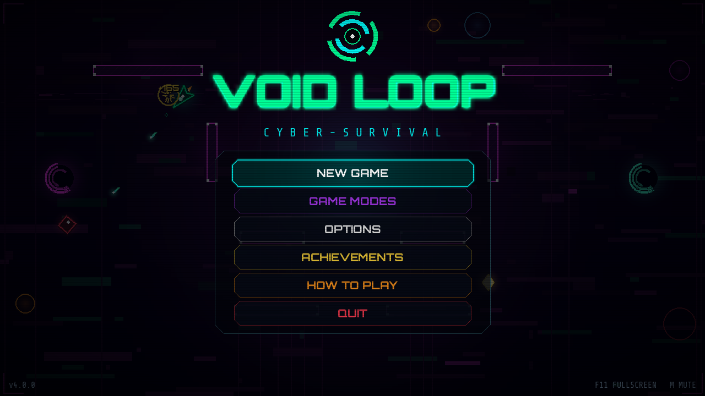
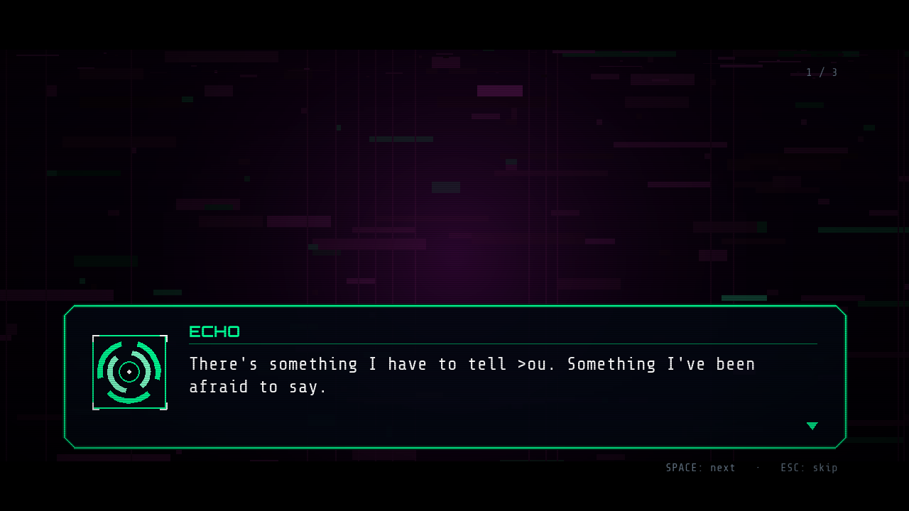
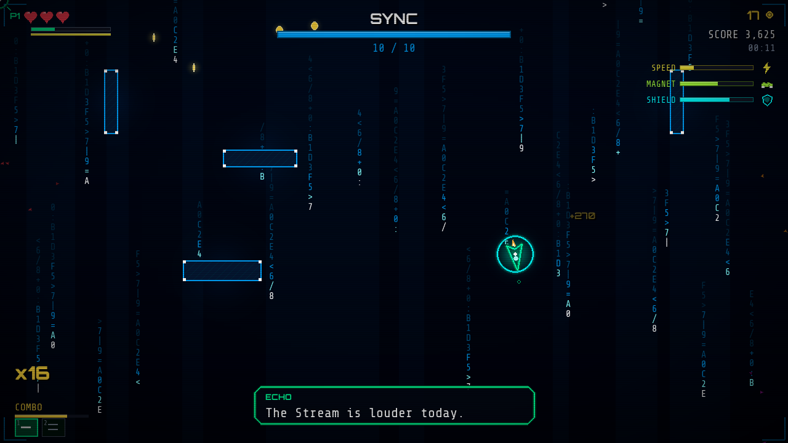
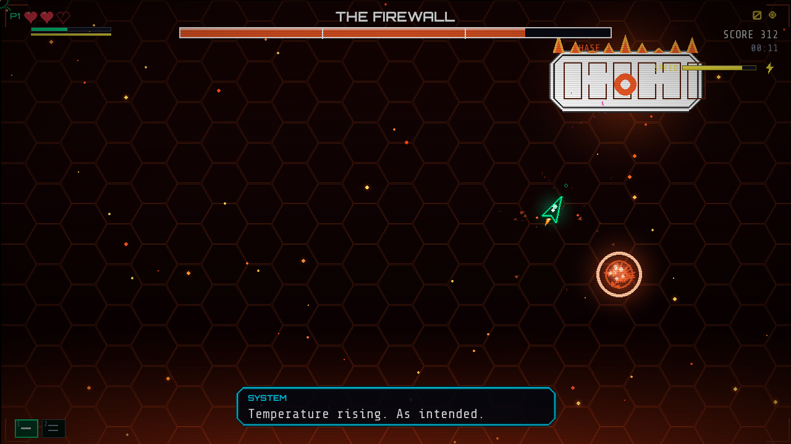
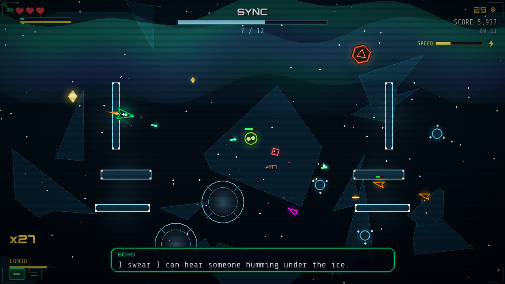
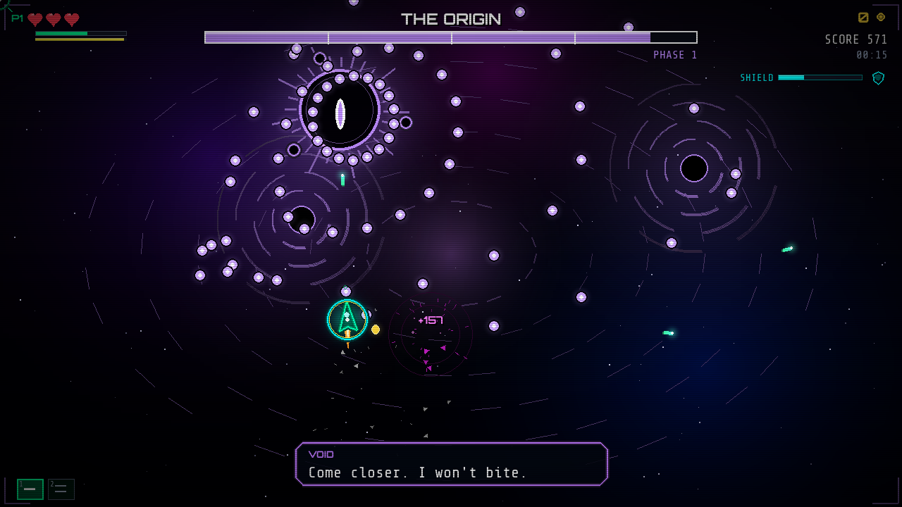
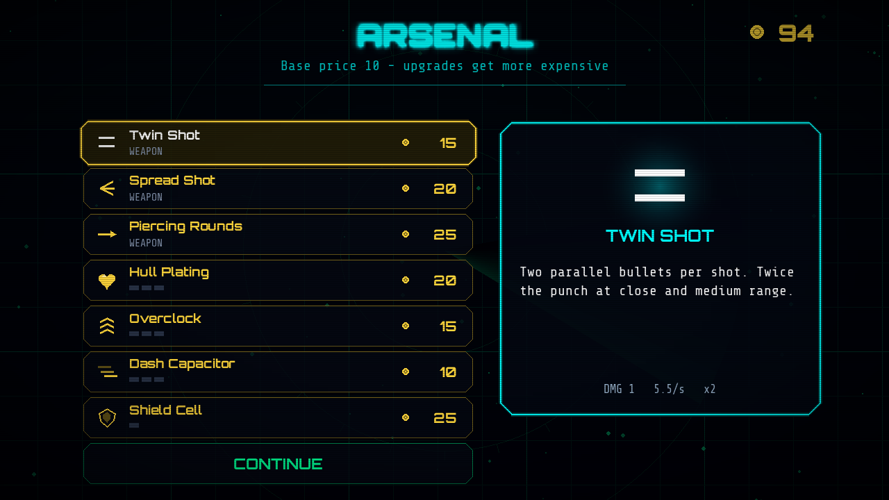

<div align="center">

# 🌀 VoidLoop

### A neon cyber-survival arcade shooter in an endless digital void

**English** · [Italiano](README.it.md)




</div>

## Download & play

Grab the build for your system from the **[Releases](../../releases)** page (or from the *Actions → Build & release* artifacts of any commit):

| System | File | How |
|--------|------|-----|
| **Windows** | `VoidLoop-…-windows-x64.msi` | Installer with Start-menu/desktop shortcuts and uninstall. |
| **Windows** | `VoidLoop-…-windows-x64.exe` | Portable single file, just double-click. |
| **Linux** | `VoidLoop-….AppImage` | `chmod +x` and run. |
| **Linux** | `voidloop_….deb` | `sudo apt install ./voidloop_….deb` (Debian, Ubuntu, Mint…). |
| **Linux** | `VoidLoop-…-linux-x86_64.tar.gz` | Unpack, run `VoidLoop/VoidLoop` or `./install.sh` (per-user install). |

> Windows may show a *SmartScreen* warning because the files are not code-signed: choose **More info → Run anyway**.

**From source** (any OS, Python 3.8+):

```bash
git clone https://github.com/BitJacker/VoidLoop.git && cd VoidLoop
pip install -r requirements.txt
python play.py
```

Saves and settings live in your user folder (`%APPDATA%\VoidLoop`, `~/.local/share/voidloop`, or `~/Library/Application Support/VoidLoop`).

## What's new in 4.0

VoidLoop was rebuilt from a single script into a proper game:

- **No more launcher window** – everything (menus, options, language) happens inside the game; scalable window + fullscreen (`F11`).
- **6 sectors**, each with its own animated background, music, palette and a hazard that changes how you play:
  Boot Sector (radar grid), Data Stream (code rain + current lanes), Firewall (hex wall + laser gates),
  Frozen Cache (aurora + ice physics + icicle strikes), Corrupted Core (glitches, portals, glitch stripes), The Void (gravity wells).
- **6 bosses** with telegraphed, multi-phase attack patterns – Sentinel, Weaver, Firewall, Archivist, Anomaly, Origin.
- **6 enemy types** (Drone, Bulwark, Lancer, Comet, Splitter, Orbiter) plus elites.
- **Hit points, dash with i-frames, stamina sprint, Pulse bomb** charged by grazing bullets, combo & graze scoring, screen shake and hit-stop.
- **Arsenal shop**: Twin / Spread / Piercing weapons, hull plating, overclock, dash capacitor, shield cell.
- **8 power-ups**: shield, speed, double damage, rapid fire, freeze, magnet, bomb, hearts.
- **A real story** in 4 languages (🇮🇹 🇬🇧 🇪🇸 🇫🇷): speakers with animated portraits, radio chatter during play, sector cards and **two endings**; New Game+ loops.
- **19 achievements**, statistics, per-mode high scores.
- **Procedural sound**: every effect and every music track is synthesized by the game at run time (no audio files).
- **Co-op** for two players with a working fire button for player 2 (the old version couldn't shoot with P2).
- Fixed: enemies with speed < 1 never moved right/down, bullets drifted (integer rect truncation), Time Attack had no clock, progress was shared between modes.








## Game modes

| Mode | Description |
|------|-------------|
| 🎬 **Story** | 6 sectors × 4 stages (3 fragment runs + a boss), shop between stages, dialogues, two endings. |
| ♾️ **Endless** | Survive: level up every 40 s, new sector every 3 levels, a boss every 6. |
| ⏱️ **Time Attack** | 3 minutes; fragments (+3 s) and kills (+1 s) buy time, the weapon evolves every 10 kills. |
| 🦸 **Boss Rush** | All six bosses back-to-back with shop visits; stronger every lap. |
| 🌊 **Horde** | Ten waves with a plasma mace that reflects bullets. |

Difficulties: **Easy** (5 HP), **Normal** (3 HP), **Hard** (2 HP), **Nightmare** (1 HP) – they also scale enemy speed, bullet speed, shop prices and score.

## Controls

| | Player 1 | Player 2 |
|-|----------|----------|
| Move | `W A S D` (arrows too when playing solo) | Arrow keys |
| Aim / fire | Mouse / left click (or `Enter` = auto-aim) | `Enter` / `Num 0` (auto-aim) |
| Dash (invulnerable) | `Left Shift` | `Right Shift` |
| Sprint | `Left Ctrl` | `Right Ctrl` |
| Pulse (when charged) | `Space` | `Right Alt` / `Num .` |
| Weapon | `1-4`, `Q`/`E`, mouse wheel | shares P1's |
| Pause · Fullscreen · Mute | `Esc`/`P` · `F11` · `M` | |

## Building the packages yourself

GitHub Actions does it for you on every push (see `.github/workflows/build.yml`). To publish a release: merge to `main`, then run
**Actions → Build & release → Run workflow** with *publish* ticked (or push a `v4.0.0` tag).

```bash
pip install -r requirements-dev.txt
python -m pytest tests -q                 # unit + integration tests (headless)
python play.py --selftest                 # resource/engine self-check (also works inside the packaged builds)

bash packaging/linux/build.sh all         # Linux: tar.gz, .deb, AppImage  -> out/
./packaging/windows/build.ps1             # Windows (PowerShell): portable .exe + .msi (needs .NET SDK for WiX) -> out/
```

Useful tools: `tools/screenshots.py` (renders every screen), `tools/autoplay.py` (an autopilot plays the real game), `tools/make_icons.py`.

## Project layout

```
play.py                  entry point
VoidLoop/                the game (world, enemies, bosses, hazards, biomes, scenes, audio synth, i18n ...)
  lang/                  ui_xx.json + dialogues_xx.json  (it, en, es, fr)
  assets/                fonts (OFL) and icon
tests/                   pytest suite      tools/   dev helpers      packaging/   PyInstaller, WiX, Linux scripts
```

Adding a language = add `ui_xx.json` + `dialogues_xx.json` and the code in `VoidLoop/settings.py`; `tests/test_i18n.py` tells you what is missing.

## License

© 2026 BitJacker – all rights reserved, see [LICENSE](LICENSE). Third-party components (pygame, SDL2, Orbitron, Share Tech Mono…) are listed in [THIRD_PARTY_NOTICES.md](THIRD_PARTY_NOTICES.md).
